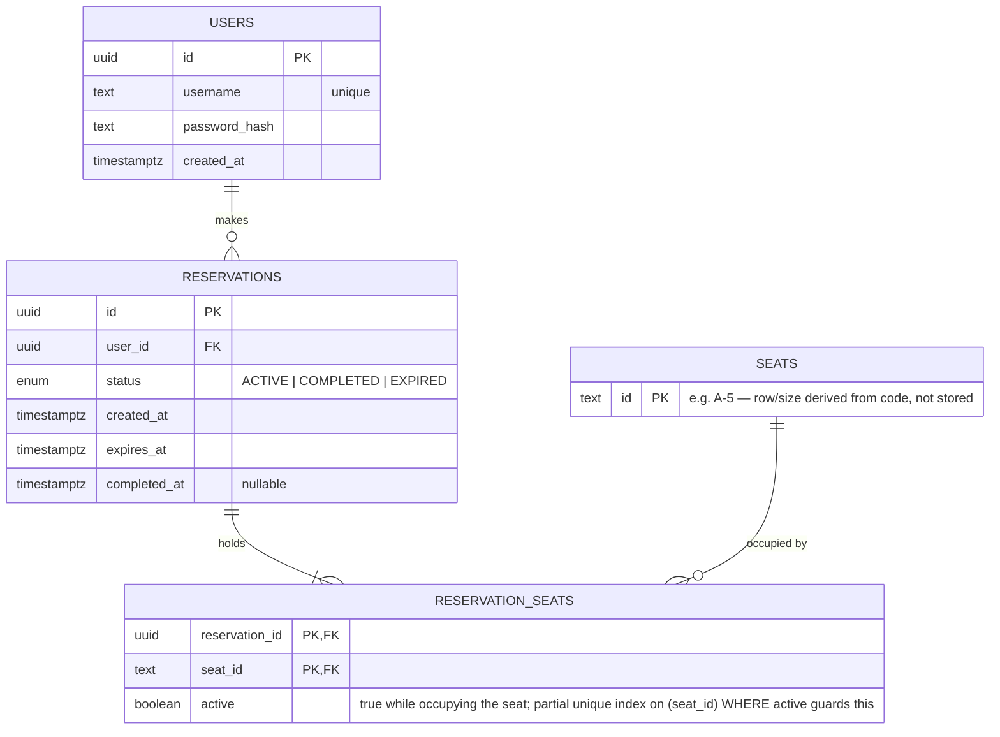

# Entity-Relationship Diagram

## Notes

- **`seats`** intentionally has no row/size columns — the cinema layout (rows `A`–`J` ×
  10 seats, `K`–`M` × 5 seats) lives entirely in
  [`domain/layout.ts`](../packages/server/src/domain/layout.ts) and is derived from the
  seat `id`. The table exists as the FK anchor for `reservation_seats` and as the target
  of the per-row lock during reservation creation.
- **`reservation_seats.active`** is the concurrency backstop. A partial unique index —
  `CREATE UNIQUE INDEX uniq_active_seat ON reservation_seats (seat_id) WHERE active = true`
  — makes it physically impossible for two rows to claim the same seat while both are
  `active`. Completing a reservation leaves `active = true` (the seat stays booked);
  expiring one flips it to `false` (the seat becomes free again).
- A reservation's lifecycle is `ACTIVE → COMPLETED` or `ACTIVE → EXPIRED`, enforced in
  application logic (`reservationService`) rather than a DB-level state machine.
